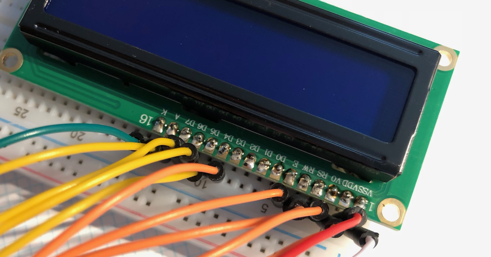
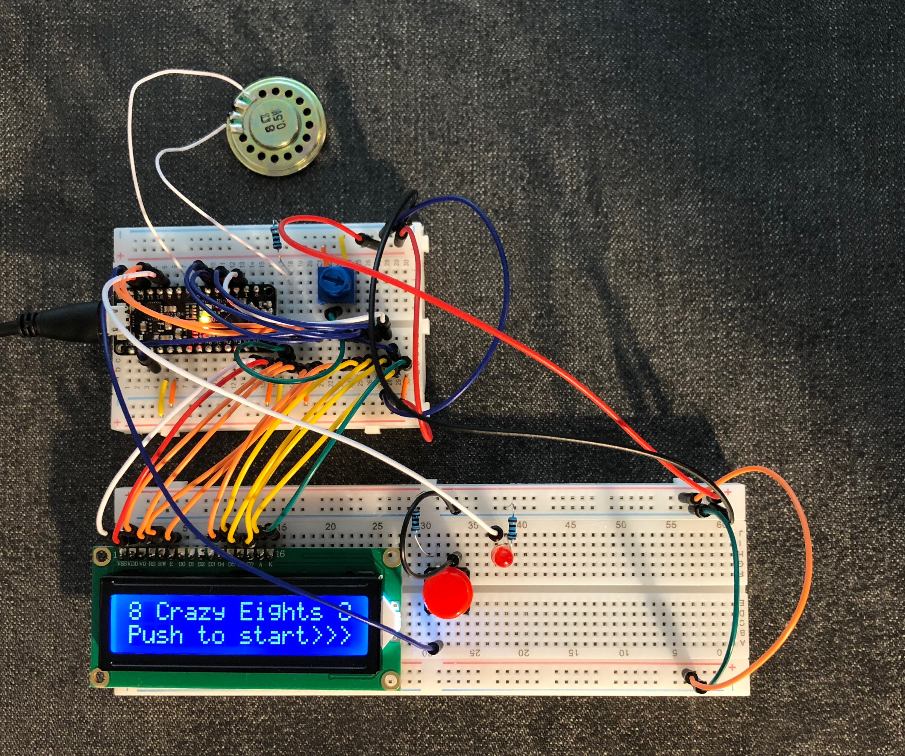

# Make a Digital Timer!
 
A lab report by Devon Bain

## Overview
For this assignment, you are going to 

A) [Solder your LCD panel](#part-a-solder-your-lcd-panel)

B) [Write text to an LCD Panel](#part-b-writing-to-the-lcd) 

c) [Using a time-based digital sensor!](#part-c-using-a-time-based-digital-sensor)

D) [Make your Arduino sing!](#part-d-make-your-arduino-sing)

E) [Make your own timer](#part-e-make-your-own-timer) 
 

## Part A. Solder your LCD panel

## Part B. Writing to the LCD
 
**a. What voltage level do you need to power your display?**

**5V**. The VDD pin, which is the power supply for logic operating according to the documentation, is connected to the 5V power supply.

**b. What voltage level do you need to power the display backlight?**

**3.3V**. As shown in the schematic, we connect pin 15 to 3.3V to power the backlight.

**c. What was one mistake you made when wiring up the display? How did you fix it?**

I initially started connecting the wires from the LCD to the wrong side of the Arduino, because the way it is oriented in the schematic is flipped from how it was positioned in real life. Once I noticed this, I fixed it by going by the labels rather than the layout of the schematic, and then checking the diagram to make sure it was correct.

**d. What line of code do you need to change to make it flash your name instead of "Hello World"?**

In the `setup()` function, you need to change the string in `lcd.print("hello, world!”);` from `"hello world"` to your name.
 
**e. Include a copy of your Lowly Multimeter code in your lab write-up.**

[Link to code](scripts/lowly-multimeter/lowly-multimeter.ino)

## Part C. Using a time-based digital sensor

**Upload a video of your working rotary encoder here.**

[Link to video](https://youtu.be/N45dCgZVsF4)

## Part D. Make your Arduino sing!

**a. How would you change the code to make the song play twice as fast?**

There are two possibilities. The first option is to change `int noteDuration = 1000 / noteDurations[thisNote];` from 1000 to 500 so that the note duration is based on half a second, not a whole second. The second option is to multiply the note duration by 2.
 
**b. What song is playing?**

The Star Wars theme is playing!

## Part E. Make your own timer

My timer, the "Crazy Eights Facilit8r" is for timing the crazy eights sketching method. In crazy eights, the objective is to generate ideas rapidly by drawing 8 ideas in 8 minutes (sometimes 5 minutes). This timer takes the place of a person manually operating a stopwatch during the sketching. The timer counts down from 60 seconds eight times. It displays the round number and the number of seconds left. Using the speaker, a sound notification lets the user know when the round changes, and which round it is based on the number of tones played.

After the final round, the screen displays "TIME'S UP!!! Press to restart>" allowing the user to press the button to start the timer again. A red LED also turns on and a sound is played to indicate it is time to stop. 

**a. Make a short video showing how your timer works, and what happens when time is up!**

This video shows how the timer can be used during crazy eights sketching, as demonstrated by an anonymous classmate:

[Link to video](https://youtu.be/jYZqsLqe-ck)

The above video has been edited and sped up for brevity. The following unedited video shows the full 8 minute countdown at normal speed, along with restarting the timer, to show that it really works as described.

[Link to unedited video](https://youtu.be/coTWFwytBik)

**b. Post a link to the completed lab report your class hub GitHub repo.**